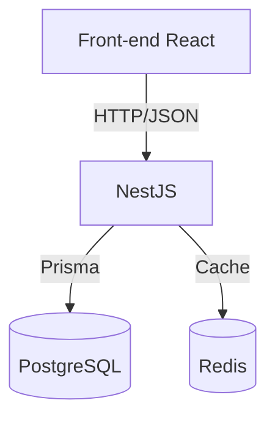

### System Patterns — Arquitetura e decisões

**Arquitetura em camadas**

- Front-end: React + TypeScript com TanStack Router (rotas), TanStack Query (dados), React Hook Form + Zod (forms/validações), biblioteca de gráficos (ex.: Recharts)
- Back-end: NestJS (modular), Prisma (ORM), PostgreSQL (dados), Redis (cache de dashboards/sessões)
- Autenticação/Autorização: JWT (roles admin/user), escopos por grupo familiar

**Domínio (entidades principais)**

- User: credenciais e perfil
- Group: agrupador familiar, relaciona usuários
- Account: contas (banco, carteira, digital) com saldo
- Category: tipifica transações (INCOME/EXPENSE, cor/ícone)
- Transaction: lançamentos (valor, data, descrição, tipo, vínculo a conta/categoria/usuário)
- Goal: metas financeiras (valor, prazo, progresso; vínculo opcional a conta/categoria)

**Módulos do back-end (previstos)**

- auth: login, registro, JWT, roles
- users: dados do usuário
- groups: grupos familiares e associação de usuários
- transactions: receitas/despesas + filtros
- accounts: contas e transferências
- categories: CRUD de categorias
- goals: metas (criação, progresso)
- dashboard: agregações (com cache Redis)
- notifications (futuro)

**Padrões**

- Respostas de API padronizadas: `{ message: string, ...payload }`
- Pipes/DTOs para validação (class-validator) e limpeza (whitelist)
- Guards para proteção com `AuthGuard('jwt')`
- Cache de leituras caras (dashboard) via Redis com invalidação em mutações relevantes

### Autenticação — Estratégia híbrida (Cookie HttpOnly + Bearer)

- Login (`POST /auth/login`) gera JWT e grava em cookie `access_token` (HttpOnly, `sameSite=lax`, `secure` em produção). O body ainda retorna `{ token: { access_token } }` para compatibilidade.
- `cookie-parser` habilitado em `main.ts` e CORS com `credentials: true` para permitir envio automático de cookies pelo navegador.
- `JwtStrategy` lê o token primeiro do cookie e, como fallback, do header `Authorization: Bearer <token>`.
- Logout (`POST /auth/logout`) limpa o cookie.
- Correção importante: o cookie deve receber a STRING do JWT (`access_token`), não o objeto `{ access_token: '...' }`.

### Categorias — Padrões de implementação

- CRUD protegido por `AuthGuard('jwt')` e escopo por `userId` em todas as consultas.
- Validação via DTOs (`CreateCategoryDto`, `UpdateCategoryDto`), incluindo enum de tipo e regex para cor hex.
- Prisma `Category` inclui `color` e `icon` para persistir personalização visual de forma consistente no back-end.

